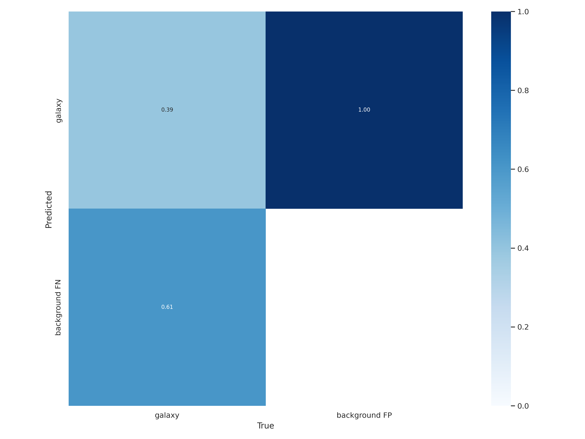
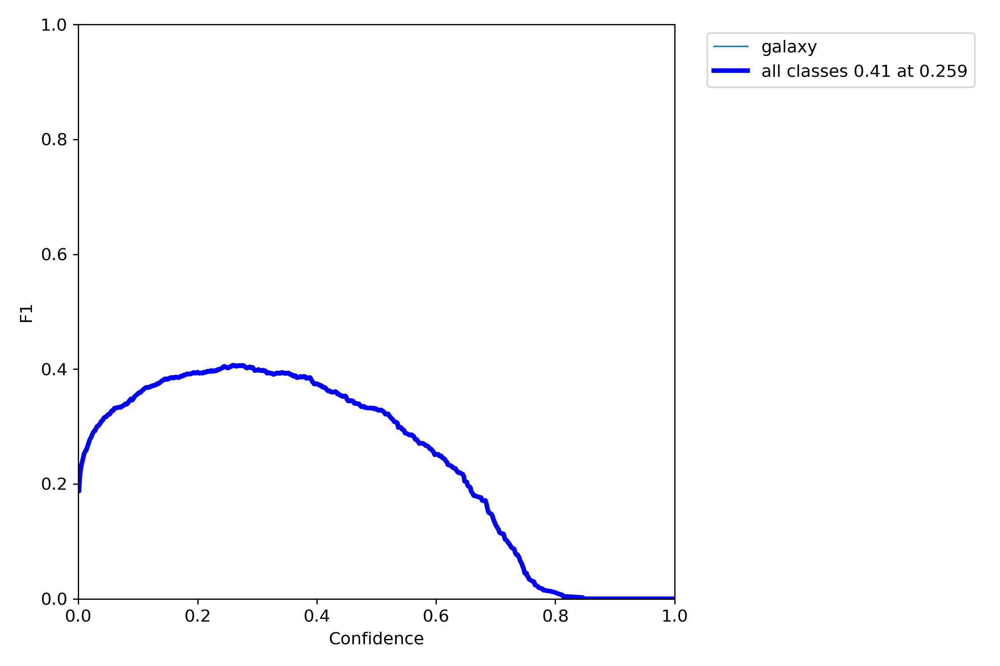
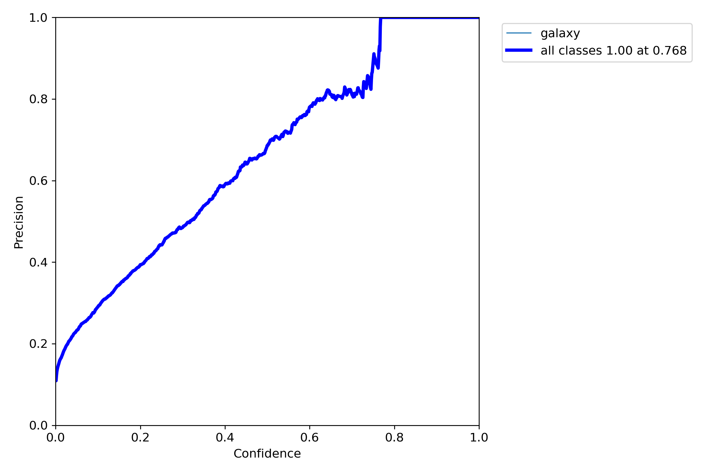
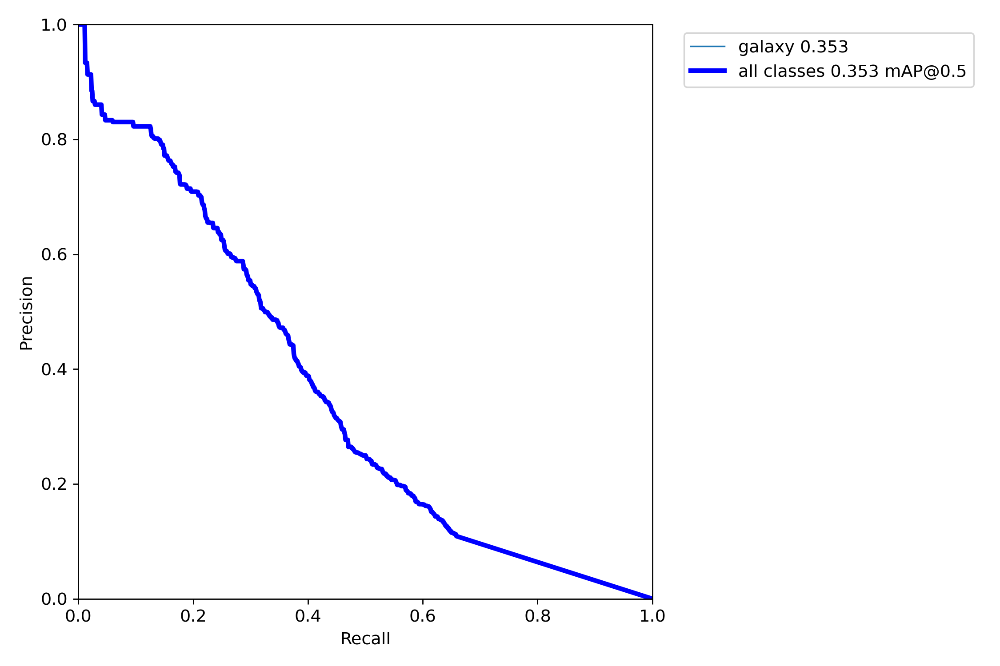
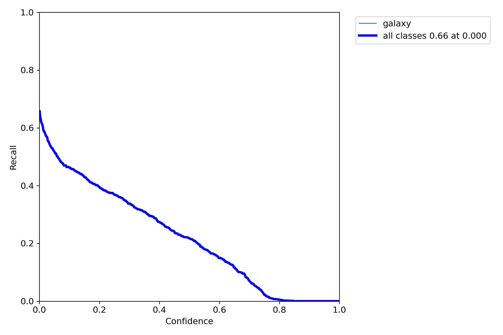
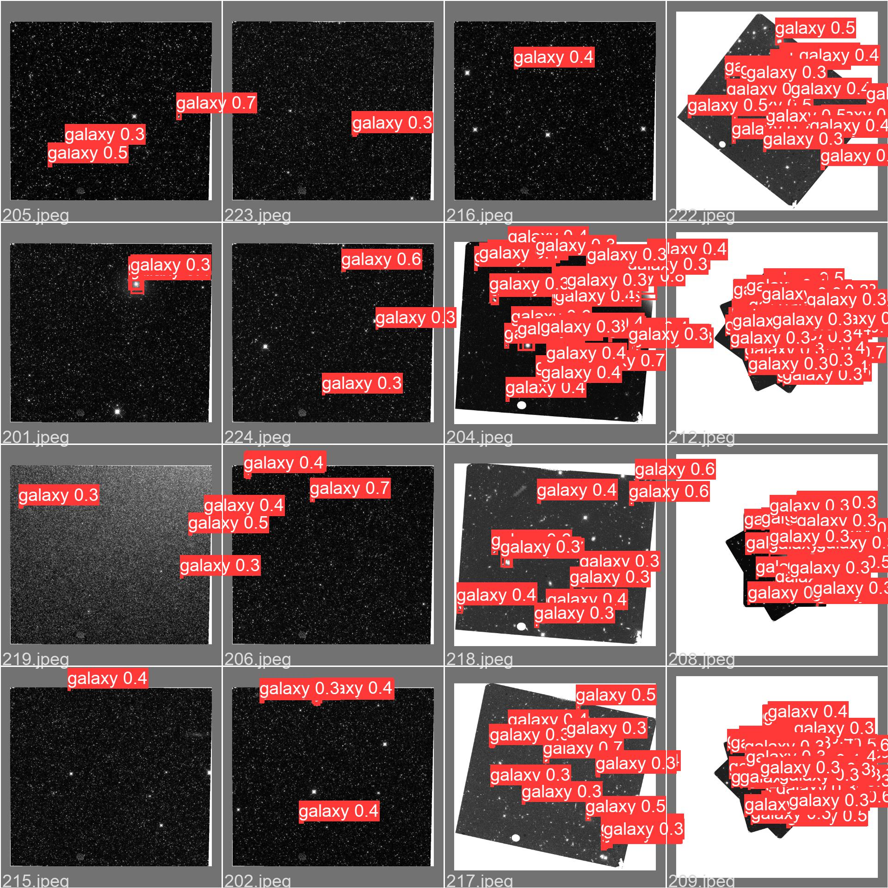

# Celestial Object Classifier

###### Madison Belk, Noah Himed

### Project Summary

The Celestial Object Classifer (COC) is a complete galaxy object detection
package which include both an API capable of fetching/processing data from the
[Hubble Legacy Archive (HLA)](https://hla.stsci.edu/hlaview.html) and scripts to run real-time galaxy object detection on a Raspberry Pi.

### Prerequistes

The `COC` software package requires the following modules:
- [astropy](https://www.astropy.org/)
- [numpy](https://numpy.org/)
- [requests](https://docs.python-requests.org/en/latest/)
- [opencv-python](https://pypi.org/project/opencv-python/)
- [scipy](https://scipy.org/)
- [torch](https://pypi.org/project/torch/)
- [torchvision](https://pypi.org/project/torchvision/)

### Image Handling API Usage

The `AstroImgHandling` API defined in `astro_img_handling.py` contains methods
allowing users to download HLA data from a list of supplied coordinates,
process raw HLA image data, and fetch pre-processed data of different levels
from the Hubble Archive.

The only public function defined for outside user use is `gen_img_set()`, which
fetches image data from the HLA with the following definition and options:
```
gen_img_set(img_path, process_manually=False, num_img=50)
```
`img_path`: A file path to the desired location to save the generated image set
            locally.

`process_manually`: A bool value indicating a preference to perform local image
                    processing. If set to `True`, the following image processing
                    steps will be attempted on images sampled from randomly
                    generated celestial coordinates:

- Image stacking
- Histogram equalization
- Application of a bilateral filter

`num_img`: The number of images to generate from randomly sampled celestial
           coordinates. This value is only used if `process_manually=True`

Image stacking is done using a module from a repo forked
from Mathias Sundholm's [image_stacking](https://github.com/maitek/image_stacking)
implementation.

### Galaxy Object Detection 

Object detection is performed by a neural network with the YOLOv5 architecture
implemented on a Raspberry Pi.

#### Training Data

Using the `AstroImgHandling` API, the script `generate_datasets.py` downloads
as many High Level Science Project (HLSP) images from the HLA as possible, and
sorts the images into a 70-20-10 split of training, validation, and testing
data.

After running this, our team was able to generate a custom labeled dataset of
224 images with 3,962 labelled examples. The [LabelImg](https://pypi.org/project/labelImg/) package was used to
label our data. This dataset may be accessed [here](https://drive.google.com/drive/folders/1DwQdLUHBD_u9jVjQ59cls07F_etIBqu6?usp=sharing).

After labeling, it is usually the case that there a sizeable number of images
without labelable galaxies in them. Additionally, it is beneficial for each
datum in the dataset to be given a unique ID for a file name. Because performing
both of these tasks manually can be tedious and error prone, the script
`format_dataset.py` is provided for such purposes.

#### Model Architecture

For object detection, the original [YOLOv5](https://github.com/ultralytics/yolov5) network is used. After some
experimentation, it was determined that the `YOLOv5m6` architecture provided
the best mix of accuracy and speed necessary for deployment on a Raspberry Pi.

Our model weights (67.9 Mb) may be downloaded [here](https://drive.google.com/file/d/1eE6ohDqo3WekTg44ltv4GGH2mYsNT4DH/view?usp=sharing).
```
Model Summary: 378 layers, 35248920 parameters, 0 gradients, 49.0 GFLOPs
```

#### Performance

The model took 1.842 hours to train on a Tesla P100 GPU, with the following
resulting training performance:

|Class|Images|Labels|P|R|mAP@.5|mAP@.5:.95:|
|---|---|---|---|---|---|---|
|all|36|748|0.558|0.4|0.436|0.166|

Performance on the test was also measured, with the following results:

|Class|Images|Labels|P|R|mAP@.5|mAP@.5:.95:|
|---|---|---|---|---|---|---|
|all|24|921|0.458|0.336|0.353|0.114|

Figures detailing other aspects of model performance follow.

##### Confusion Matrix


##### F1 Curve


##### Precision Curve


##### Precision Recall Curve


##### Recall Curve


##### Sample Predictions

